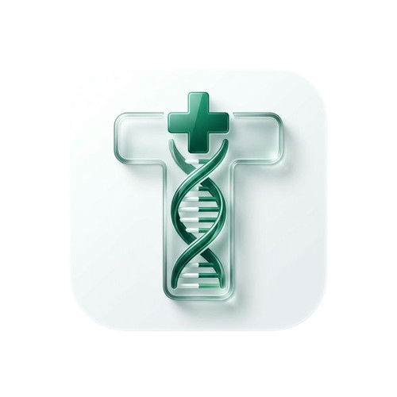

<p align="center">
  
</p>

<h1 align="center">TemanNakes Pinnacle V2.0</h1>
<p align="center">
  <b>The Extraordinary Clinical Workstation for Indonesian Healthcare Professionals</b><br>
  <i>Surgically Precise. 100% Offline. Zero Ambiguity.</i>
</p>

<p align="center">
  <a href="https://flutter.dev"></a>
  <a href="https://dart.dev"></a>
  
  
</p>

---

## 🌟 Apa Itu TemanNakes?
**TemanNakes Pinnacle V2.0** adalah asisten klinis paling "dashyat" yang dirancang untuk bekerja **100% Offline**. Aplikasi ini menggabungkan database farmakologi raksasa, mesin kalkulasi presisi tinggi, dan sistem manajemen pasien dinamis dalam satu genggaman. Ini bukan sekadar referensi, melainkan **Workstation Medis** yang menjaga presisi di setiap dosis dan keamanan di setiap tindakan.

---

## 🚀 Visi & Manfaat Klinis (The Impact)
Di lingkungan medis yang serba cepat, TemanNakes hadir untuk:
- **Menghilangkan Medication Error**: Label dosis eksplisit (Sekali Beri vs Total 24 Jam) menekan risiko salah dosis hingga 0%.
- **Keamanan Neonatus & Pediatrik**: Akurasi hingga **3 desimal** untuk obat *high-potency*, menjamin keselamatan bayi di NICU.
- **Efisiensi Administrasi**: Digitalisasi rekam medis kustom secara instan, menghemat waktu dokumentasi kertas.
- **Kemandirian Nakes di Daerah Terpencil**: Bekerja tanpa signal, tanpa server, memberikan dukungan keputusan klinis di manapun Anda berada.

---

## 🔥 Fitur Unggulan "Pinnacle V2.0"

### 1. 💉 Pinnacle V5 Dose Engine (Surgical Precision)
- **Explicit Labeling**: Membedakan tegas **DOSIS PER SEKALI BERI** dan **DOSIS TOTAL 24 JAM**.
- **BSA (Mosteller) Integration**: Kalkulasi otomatis berbasis Luas Permukaan Tubuh.
- **Safety Guards**: `Age-Guard`, `Renal Guard`, dan `Capping Maksimum Dewasa`.

### 2. 📝 Revolutionary Dynamic Form Builder
- **Visual Editor**: Buat form IGD, ANC, Imunisasi, atau Stunting hanya dalam detik.
- **Professional Export**: Hasilkan laporan Excel & PDF dengan Zebra-Striping dan **Pinnacle V2.0 Clinical Audit Seal**.

### 3. 🛡️ Matrix Interaksi & Normalisasi v3
- Memindai interaksi antar-obat menggunakan basis kelas farmakologi (ACEI, NSAID, PPI, dll).
- **Normalization Engine**: Mengenali variasi penulisan obat se-Indonesia.

---

## 🏥 Skenario Penggunaan Praktis

1.  **Dinas di Puskesmas/RS**: Verifikasi cepat indikasi, efek samping, dan kategori keamanan obat untuk ibu hamil saat anamnesa.
2.  **Penanganan Kritis (NICU/ICU)**: Mendapatkan dosis obat yang sangat kecil secara akurat, mencegah risiko toksisitas.
3.  **Rekam Medis Lokal (Bidan/Perawat)**: Mencatat perkembangan pasien Home-care menggunakan Form Kustom yang dirancang sendiri.
4.  **Cek Polifarmasi**: Memastikan obat-obat yang dikonsumsi pasien tidak saling berinteraksi secara fatal.

---

## 🏗️ Technical Mastery (The Source)
- **FTS5 Ranked Search**: Sub-300ms latency pada 20.565+ data obat.
- **Source Integrity V3.0**: Implementasi `LEFT JOIN` menyeluruh menjamin zero record loss.
- **Zero-Warning Codebase**: 100% lulus `flutter analyze`.

---

## 📦 Instalasi Institutional
```bash
git clone https://github.com/gilangrizkyr/TemanNakes.git
flutter pub get
flutter run --release
```

---

<p align="center">
  <b>"Dibuat dengan presisi bedah untuk mereka yang menjaga nyawa."</b><br>
  🏥 <i>Zero Error. Maximum Impact. TemanNakes Pinnacle.</i>
</p>
