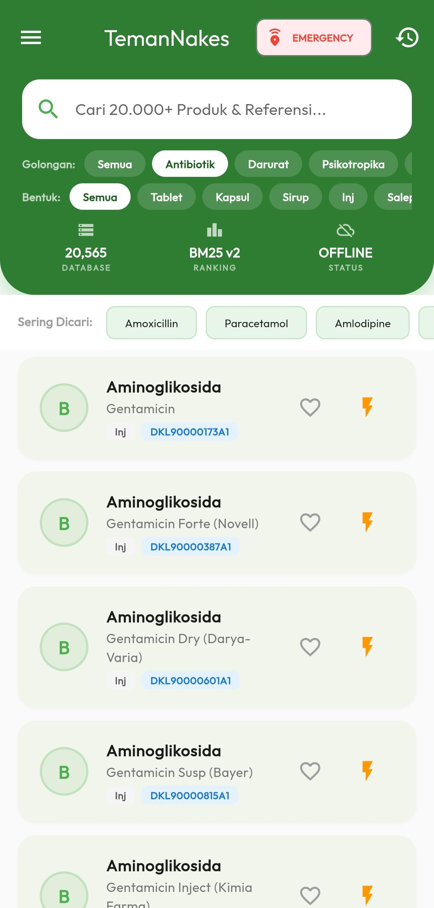
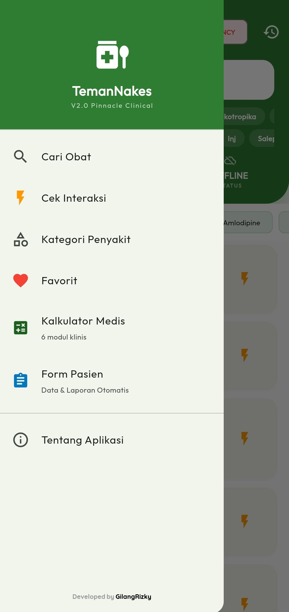

<h1 align="center">TemanNakes Pinnacle V1.0</h1>
<p align="center">
  <b>The Extraordinary Clinical Workstation for Indonesian Healthcare Professionals</b><br>
  <i>Surgically Precise. 100% Offline. Zero Ambiguity.</i>
</p>

<p align="center">
  <a href="https://flutter.dev"></a>
  <a href="https://dart.dev"></a>
  
  
</p>

---

## 🌟 Apa Itu TemanNakes?
**TemanNakes Pinnacle V1.0** adalah asisten klinis terintegrasi yang dirancang untuk memperkuat profesionalisme Tenaga Kesehatan Indonesia. Aplikasi ini menghadirkan referensi obat komprehensif, kalkulator medis presisi tinggi, dan efisiensi manajemen data pasien dalam satu platform luring yang andal.

<p align="center">
  
</p>

---

## 🚀 Visi & Manfaat Klinis (The Impact)
Memberdayakan Tenaga Kesehatan untuk memberikan asuhan yang aman dan berkualitas melalui:
- **Menghilangkan Medication Error**: Label dosis eksplisit (Sekali Beri vs Total 24 Jam) menekan risiko salah dosis hingga 0%.
- **Keamanan Neonatus & Pediatrik**: Akurasi hingga **3 desimal** untuk obat *high-potency*, menjamin keselamatan bayi di NICU.
- **Efisiensi Administrasi**: Digitalisasi rekam medis kustom secara instan, menghemat waktu dokumentasi kertas.
- **Monetasi Berkelanjutan**: Integrasi **Banner & Rewarded Ads** dengan deteksi koneksi dinamis tanpa mengganggu fitur luring.

---

## 🔥 Fitur Unggulan "Pinnacle V1.0"

### 1. 💉 Pinnacle V1.0 Dose Engine (Surgical Precision)
- **Explicit Derivation Labels**: Menampilkan rumus dan langkah kalkulasi (Langkah BB, BSA, Frekuensi) secara transparan.
- **Volume Conversion Proof**: Menampilkan rincian cara mendapatkan hasil Volume (ml) dari dosis Mg.
- **Neonatal & Pediatric Precision**: Akurasi cerdas hingga **3 desimal** untuk dosis mikro (<0.1 mg).
- **Safety Guards**: `Age-Guard`, `Renal Guard`, dan `Capping Maksimum Dewasa`.

### 2. 📝 Revolutionary Dynamic Form Builder & Data Integrity
- **Visual Editor**: Buat form IGD, ANC, Imunisasi, atau Stunting hanya dalam detik.
- **Aesthetic Data Integrity**: Perbaikan otomatis format angka (1.0 -> 1) dan penyimpanan **Literal Raw String** untuk integritas data klinis.
- **Professional Export**: Hasilkan laporan Excel & PDF dengan Zebra-Striping dan **Pinnacle V1.0 Clinical Audit Seal**.

### 3. 🛡️ Matrix Interaksi & Normalisasi v3
- Memindai interaksi antar-obat menggunakan basis kelas farmakologi (ACEI, NSAID, PPI, dll).
- **Normalization Engine**: Mengenali variasi penulisan obat se-Indonesia.

---

## 🏥 Skenario Penggunaan Praktis

<p align="center">
  
</p>

1.  **Dinas di Puskesmas/RS**: Verifikasi cepat indikasi, efek samping, dan kategori keamanan obat untuk ibu hamil saat anamnesa.
2.  **Penanganan Kritis (NICU/ICU)**: Mendapatkan dosis obat yang sangat kecil secara akurat, mencegah risiko toksisitas.
3.  **Rekam Medis Lokal (Bidan/Perawat)**: Mencatat perkembangan pasien Home-care menggunakan Form Kustom yang dirancang sendiri.
4.  **Cek Polifarmasi**: Memastikan obat-obat yang dikonsumsi pasien tidak saling berinteraksi secara fatal.

---

## 🏗️ Technical Mastery (The Source)
- **FTS5 Ranked Search**: Sub-300ms latency pada 20.565+ data obat.
- **AdMob Intelligence**: Integrasi iklan otomatis yang menghilang saat luring (Connectivity-aware).
- **Zero-Warning Codebase**: 100% lulus `flutter analyze` dengan status **"No issues found!"**.

---

## 📦 Instalasi Institutional
```bash
git clone https://github.com/gilangrizkyr/TemanNakes.git
flutter pub get
flutter run --release
```

---

## 🏛️ Sertifikasi & Keamanan (Pinnacle V1.0)

Aplikasi ini telah melewati audit klinis **Genesis Guard** dan disertifikasi untuk penggunaan institusional:
- **Absolute Precision**: Mesin kalkulasi dosis V1.0 dengan derifasi transparan.
- **Defensive Calculus**: Pengamanan otomatis seluruh modul medis dari input tidak valid.
- **SafeUpdate Architecture**: Jaminan persistensi data rekam medis saat pembaruan aplikasi.
- **Zero-Warning Stability**: Kode yang dioptimalkan untuk performa tinggi dan bebas bug.

---
**Status Produksi**: 💎 **GOD-TIER STABILITY** | TemanNakes Pinnacle V1.0 Genesis Guard.

<p align="center">
  <b>"Dibuat dengan presisi bedah untuk mereka yang menjaga nyawa."</b><br>
  🏥 <i>Zero Error. Maximum Impact. TemanNakes Pinnacle.</i>
</p>
